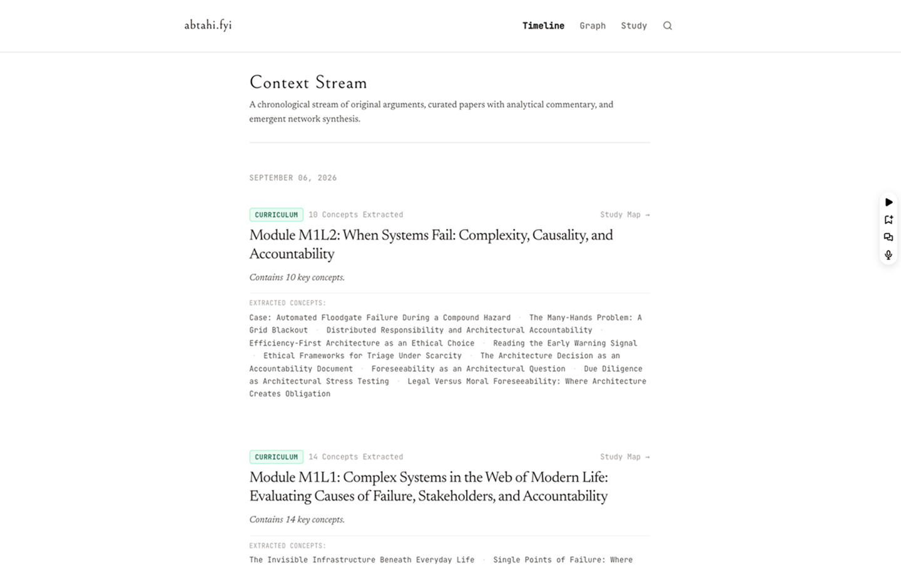

<div align="center">

# 🏛️ abtahi.fyi

### *The Systems Scriptorium: An Evidence-Grounded Knowledge Graph & Learning Sanctuary Powered by Google Gemini*

[](https://abtahi-fyi-qvj33q6t2a-uc.a.run.app)
[](https://ai.google.dev/)
[](https://firebase.google.com/)
[](https://www.python.org/)
[](#-well-architected-cloud--security-posture)
[](LICENSE)

[**🌐 Live Cloud Run Deployment**](https://abtahi-fyi-qvj33q6t2a-uc.a.run.app) • [**🎥 Video Walkthrough (YouTube)**](https://www.youtube.com/watch?v=L7d-ylQFIp8) • [**📝 Story & Deep Dive (Medium)**](https://medium.com/@abdullahabtahi21/why-economics-taught-me-gradient-descent-3179ede4d28d) • [**🛡️ Security Posture**](#-well-architected-cloud--security-posture)

</div>

---

## 🎯 Overview & Motivation

> *"Why did marginal analysis in economics teach me gradient descent in deep learning?"*

I tend to explore multiple technical domains (AI/ML, economic complexity, distributed systems, water infrastructure), our breakthrough moments happen when disparate concepts intersect. Yet most personal knowledge systems suffer from **Synthesis Amnesia**:

1. **The Note Graveyard**: Notes jotted down in fragmented apps become inert digital fossils.
2. **The AI Firehose Problem**: Generic AI tools dump ungrounded summaries and fabricate phantom links without source evidence.
3. **The Unbounded Cognitive Tax**: Constant notification feeds and endless backlog anxiety break deep study.

**`abtahi.fyi`** solves this through a **calm, bounded, and evidence-grounded architecture**. It turns raw syllabi and course notes into a living 2D knowledge graph where **the AI proposes connections with exact citation offsets, and the human learner remains the sole approval authority.**

---

<div align="center">
  <a href="https://www.youtube.com/watch?v=L7d-ylQFIp8" target="_blank" rel="noopener noreferrer">
    
  </a>
  <p><em>Figure 1: Interactive Canvas 2D Knowledge Graph and the Bounded Daily Review Queue (Click image to watch demo video on YouTube).</em></p>
</div>

---

## 🏛️ System Architecture: Two-Plane Isolation

`abtahi.fyi` strictly separates its operating model into two planes to ensure cognitive clarity and data confidentiality:

1. **The Public Scriptorium (Reading Plane)**: A high-contrast, typography-first publication for essays, timeline milestones, and interactive neighborhood graph exploration. Built with zero authentication clutter in the header.
2. **The Private Sanctuary (Study Plane)**: A zero-trust authenticated workspace (`/study`, `/today`, `/study/ingest`, `/sources`) strictly bound to the authenticated learner.

```
                     ┌─────────────────────────────────────────────────────────┐
                     │                 PUBLIC READING PLANE                    │
                     │  - Reading-First Timeline    - Interactive 2D Graph     │
                     │  - Machine Syndication       - Sub-5ms SQLite Search    │
                     └────────────────────────────┬────────────────────────────┘
                                                  │ (Public Read-Only Cache)
┌─────────────────────────────────────────────────┴──────────────────────────────────────────────┐
│                                   GOOGLE CLOUD RUN WORKLOAD                                    │
│                                                                                                │
│   ┌───────────────────────┐        ┌───────────────────────┐        ┌──────────────────────┐   │
│   │  Curriculum Ingestion │  OIDC  │   Nightly Synthesis   │        │   Bounded Review     │   │
│   │   Engine (/ingest)    │◄───────┤  (Cloud Scheduler)    │        │   Queue (/today)     │   │
│   └───────────┬───────────┘        └───────────┬───────────┘        └──────────▲───────────┘   │
│               │                                │                               │ (0-3 / Day)   │
│               ▼                                ▼                               │               │
│   ┌────────────────────────────────────────────────────────┐                   │               │
│   │        Google Gemini API (Multi-Turn Reasoning)        │───────────────────┘               │
│   │  - Structured Concept Extraction  - Evidence Grounding │  Evidence Proposals               │
│   │  - Exact Character Offset Citations                    │  (Match Confidence > 0.85)        │
│   └────────────────────────────────────────────────────────┘                                   │
└─────────────────────────────────────────────────┬──────────────────────────────────────────────┘
                                                  │ Zero-Trust Writes
                                                  ▼
                     ┌─────────────────────────────────────────────────────────┐
                     │                 PRIVATE STUDY PLANE                     │
                     │  - Cloud Firestore (Multi-Tenant Isolated Storage)      │
                     │  - Immutable Source Passages & Revisions                │
                     │  - Human Consent Gated Edge Activation                  │
                     └─────────────────────────────────────────────────────────┘
```

---

## 🛡️ Well-Architected Cloud & Security Posture

Built in alignment with the **Google Cloud Well-Architected Framework (Security & Operational Excellence Pillars)** and **Google's Secure AI Framework (SAIF)**:

### 1. Zero Trust & Identity Lifecycle
* **Authentication**: Firebase Auth with strictly verified JSON Web Tokens (JWT).
* **Session Integrity**: Hardened, server-issued `Secure`, `HttpOnly`, `SameSite=Lax` session and CSRF companion cookies.
* **Granular Role Isolation**: Public readers have zero access to study routes. Private mutations require valid `X-CSRF-Token` and an `Idempotency-Key`.

### 2. Defense in Depth & Data Confidentiality
* **Multi-Tenant Firestore Isolation**: Strict Firestore Security Rules guarantee zero cross-user data leakage.
* **Ephemeral Secret Injection**: Zero hardcoded credentials or API keys in source code or Docker layers. All runtime secrets (Gemini API tokens, CSRF keys) are injected dynamically from **Google Cloud Secret Manager**.
* **Privileged Background Execution**: Scheduled maintenance (feed polling, nightly synthesis) is triggered exclusively by **Google Cloud Scheduler** using OIDC service account identity with least-privilege `roles/run.invoker`. All external unauthenticated requests to maintenance endpoints receive `403 Forbidden`.

### 3. Safe, Responsible AI (Human-in-the-Loop)
* **No Phantom Edges**: The Gemini model cannot silently mutate the knowledge graph.
* **Exact Provenance & Traceability**: Every proposed relationship is anchored to an immutable source revision with exact start/end character offsets.
* **Cognitive Guardrails**: The daily review queue enforces a hard cap of **0 to 3 evidence-backed proposals per day** (`/today`) with clear actions: `Connect`, `Defer`, `Dismiss`, or `Edit`.

### 4. Zero-Node Operational Simplicity & High Performance
* **Pure Python Runtime**: Python 3.12 + FastAPI with precompiled static assets and HTMX partials. Zero Node.js runtime vulnerabilities in production.
* **Sub-5ms Hybrid Retrieval**: Dual search layer combining SQLite FTS5 (lexical) and `sqlite-vec` (dense vector embeddings) managed with WAL mode.
* **Serverless Elasticity**: Deployed as a hardened non-root container to **GCP Cloud Run**, scaling automatically to zero when idle.

---

## 📸 Key Features Tour

<!-- PLACEHOLDER: Features Grid -->
| Feature | Visual Preview | Description |
| :--- | :---: | :--- |
| **Curriculum Ingest** | <!-- PLACEHOLDER: Ingest Screenshot --> `docs/assets/preview-ingest.png` | Ingests complex markdown notes and course syllabi, parsing hierarchical modules, lessons, and prerequisites. |
| **Bounded Review Queue** | <!-- PLACEHOLDER: Today Screenshot --> `docs/assets/preview-today.png` | Anti-overwhelm review showing exact citation excerpts and match strength metrics before approval. |
| **Interactive Study Map** | <!-- PLACEHOLDER: Study Map Screenshot --> `docs/assets/preview-study-map.png` | Canvas 2D interactive 1-to-2-hop neighborhood exploration with structured accessible tabular fallbacks. |
| **Immutable Sources** | <!-- PLACEHOLDER: Sources Screenshot --> `docs/assets/preview-sources.png` | Tamper-proof source versioning and passage indexing ensuring absolute provenance for every connection. |

---

## 🛠️ Technology Stack

* **Backend & API**: Python 3.12, FastAPI, Pydantic v2, NetworkX
* **Storage & Vectors**: Cloud Firestore (NoSQL isolated store), SQLite (WAL Mode + FTS5 + `sqlite-vec`)
* **AI & Machine Learning**: Google Gemini Pro (Multi-turn generation & structured concept extraction)
* **Frontend / UI**: Jinja2 Templates, HTMX 2.x, Alpine.js, Tailwind CSS (Standalone CLI), `vasturiano/force-graph` (Canvas 2D)
* **Cloud Infrastructure**: Google Cloud Run, Cloud Secret Manager, Cloud Scheduler (OIDC), Firebase Auth, Cloud Logging

---

## ⚡ Local Development & Testing

### Prerequisites
* Python 3.12+
* Google Cloud SDK (`gcloud`) & Firebase CLI (optional for remote ops)

### Quickstart

```bash
# 1. Clone repository
git clone https://github.com/your-username/abtahi.fyi.git
cd abtahi.fyi/abtahi-fyi

# 2. Set up virtual environment
python3 -m venv .venv
source .venv/bin/activate

# 3. Install dependencies in editable mode
pip install -e .[test]

# 4. Run test suite
pytest -v

# 5. Launch development server
uvicorn app.main:app --reload --port 8000
```

Navigate to `http://127.0.0.1:8000/` to explore the local instance.

---

## 🚀 Production Deployment & Release Verification

The production service is deployed to **Google Cloud Run** using automated verification scripts:

```bash
# Deploy zero-trust Firestore security rules
firebase deploy --only firestore:rules,firestore:indexes

# Deploy container to Cloud Run with health smoke test
./deploy/deploy.sh

# Configure least-privilege OIDC Cloud Scheduler jobs
./deploy/scheduler.sh
```

### Verified Release Metadata

| Parameter | Production Value |
| :--- | :--- |
| **Service Identifier** | `abtahi-fyi` |
| **Active Cloud Run Revision** | `abtahi-fyi-00008-rdc` |
| **Mandatory Challenge Label** | `dev-tutorial=cloud-run-ai-challenge` |
| **GCP Project** | `spatial-cat-489006-a4` (Region: `us-central1`) |
| **Live Service Endpoint** | [https://abtahi-fyi-qvj33q6t2a-uc.a.run.app](https://abtahi-fyi-qvj33q6t2a-uc.a.run.app) |
| **Direct Domain** | [https://abtahi-fyi-903682941870.us-central1.run.app](https://abtahi-fyi-903682941870.us-central1.run.app) |
| **Health Check Probes** | `GET /health` (`200 OK`), `GET /healthz` (`200 OK`) |
| **Privileged Cloud Scheduler Jobs** | • `abtahi-fyi-poll-feeds` (`0 */6 * * *`) &rarr; `POST /api/poll-feeds`<br>• `abtahi-fyi-consolidate` (`0 3 * * *`) &rarr; `POST /api/consolidate` |

---

## 📄 License

This project is licensed under the [MIT License](LICENSE).


